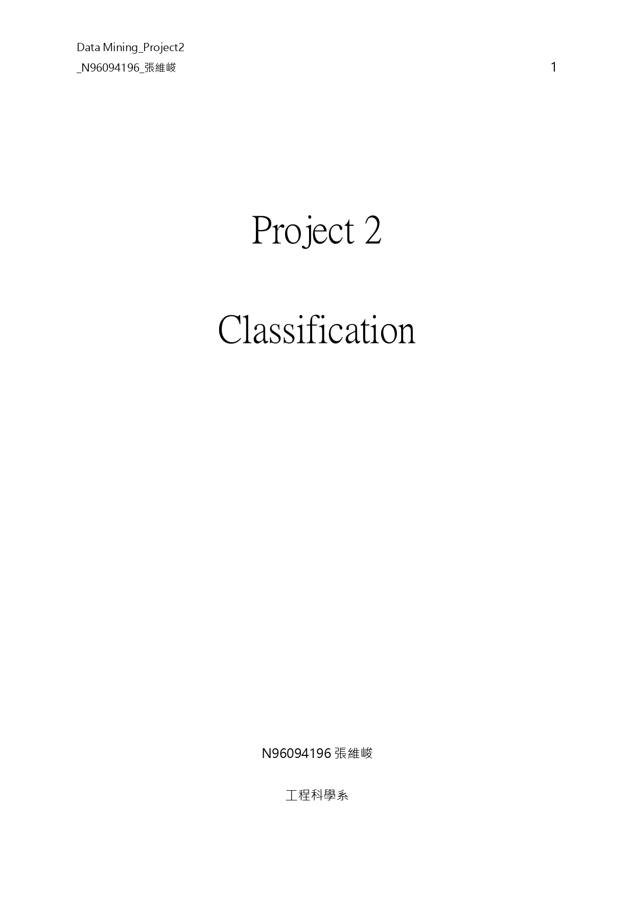
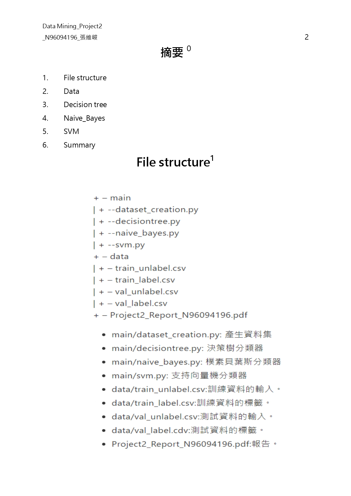
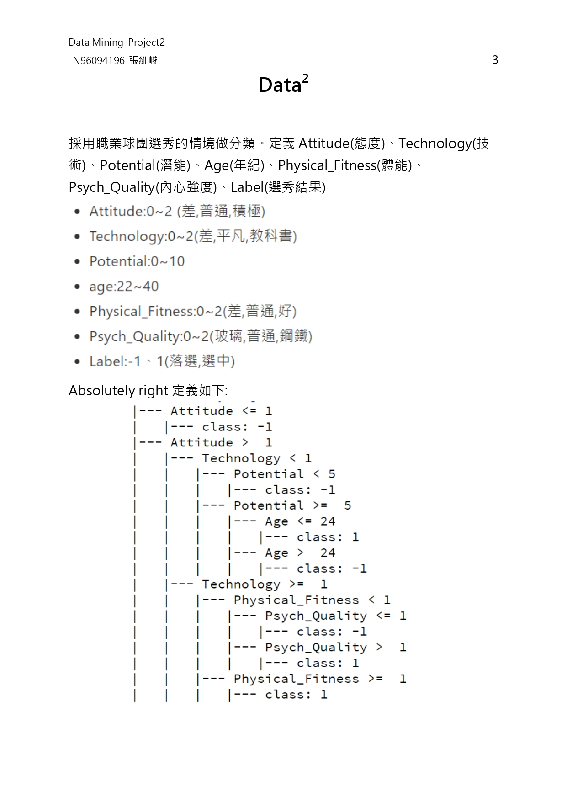
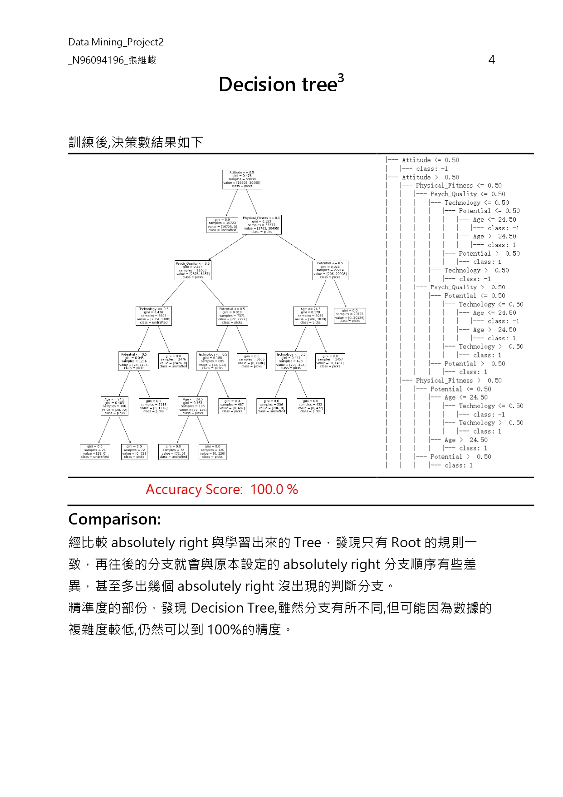
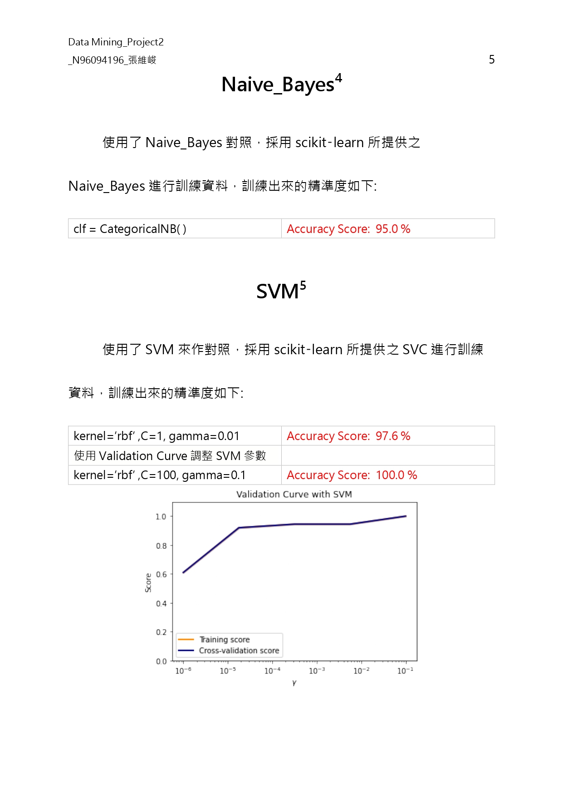
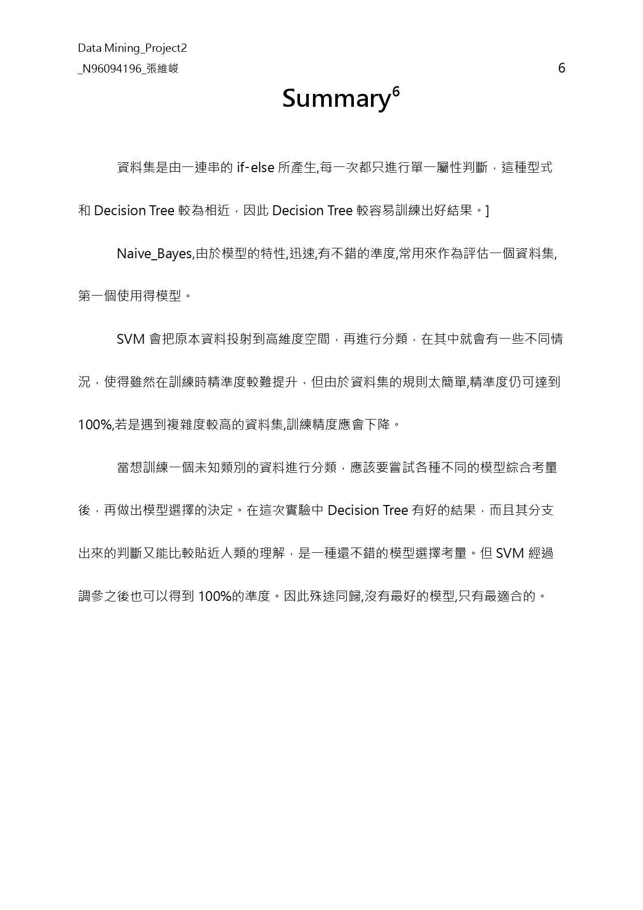

<!-- # DM_Classification

Project 2
Classification

摘要0
1.	File structure
2.	Data
3.	Decision tree
4.	Naive_Bayes
5.	SVM
6.	Summary
File structure1
 
Data2
採用職業球團選秀的情境做分類。定義Attitude(態度)、Technology(技術)、Potential(潛能)、Age(年紀)、Physical_Fitness(體能)、Psych_Quality(內心強度)、Label(選秀結果)
 
* Absolutely right 定義如下:
|--- Attitude <= 1
|   |--- class: -1
|--- Attitude >  1
|   |--- Technology < 1
|   |   |--- Potential < 5
|   |   |   |--- class: -1
|   |   |--- Potential >=  5
|   |   |   |--- Age <= 24
|   |   |   |   |--- class: 1
|   |   |   |--- Age >  24
|   |   |   |   |--- class: -1
|   |--- Technology >=  1
|   |   |--- Physical_Fitness < 1
|   |   |   |--- Psych_Quality <= 1
|   |   |   |   |--- class: -1
|   |   |   |--- Psych_Quality >  1
|   |   |   |   |--- class: 1
|   |   |--- Physical_Fitness >=  1
|   |   |   |--- class: 1
 
## File Structure
\+ -- main
 |   + --dataset_creation.py
 |   + --decisiontree.py
 |   + --naive_bayes.py
 |   + --svm.py
\+ -- data
 |   + -- train_unlabel.csv
 |   + -- train_label.csv
 |   + -- val_unlabel.csv
 |   + -- val_label.csv
\+ -- Project2_Report_N96094196.pdf
* main/dataset_creation.py: 產生資料集
* main/decisiontree.py: 決策樹分類器
* main/naive_bayes.py: 樸素貝葉斯分類器
* main/svm.py: 支持向量機分類器
* data/train_unlabel.csv:訓練資料的輸入。
* data/train_label.csv:訓練資料的標籤。
* data/val_unlabel.csv:測試資料的輸入。
* data/val_label.cdv:測試資料的標籤。
* Project2_Report_N96094196.pdf:報告。 -->

